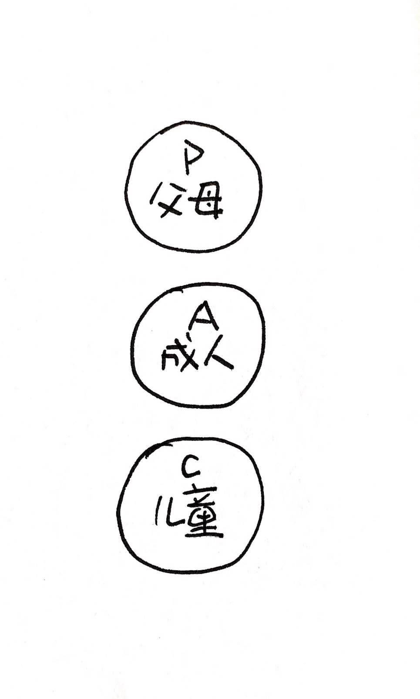
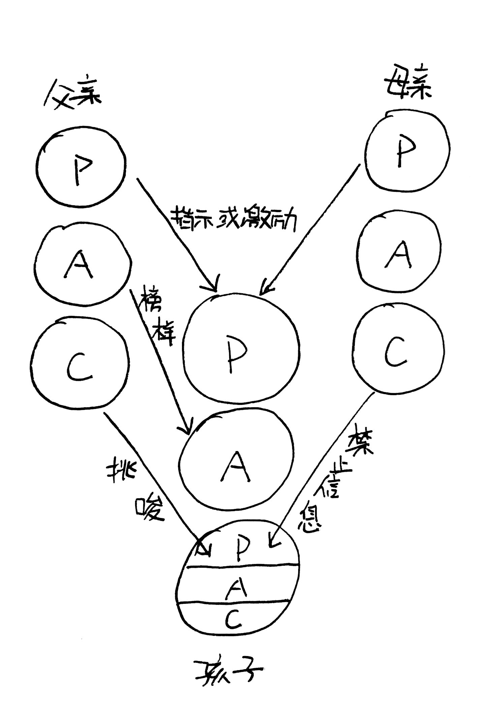
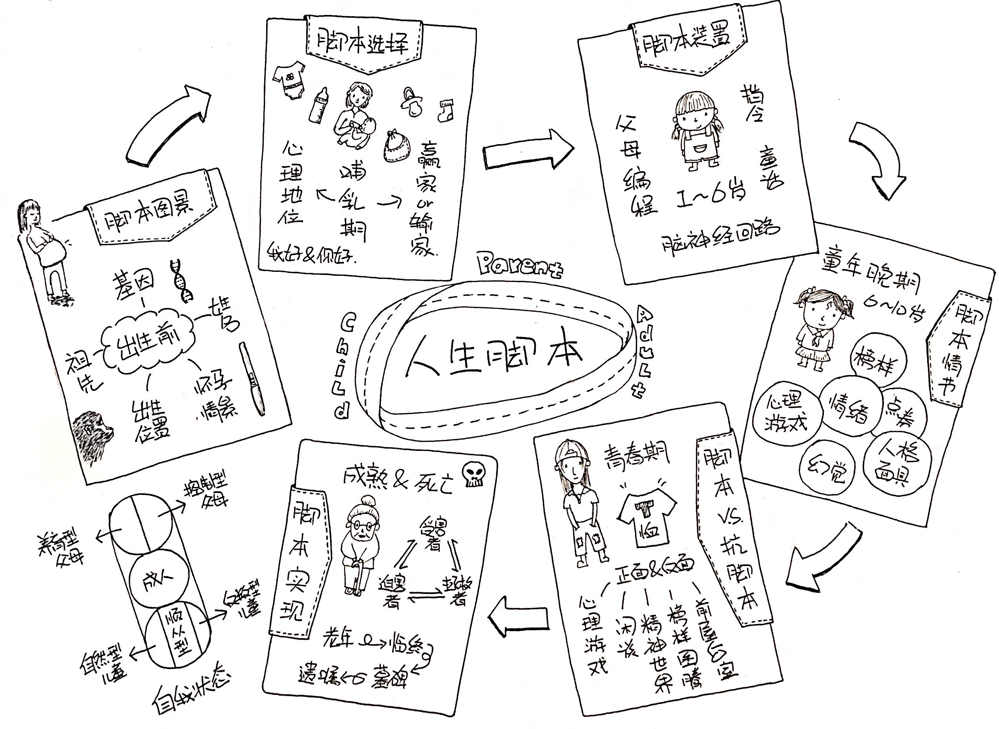

《西部世界》片头，一只机器人在弹奏钢琴，随着音乐进入高潮，机器人的手缓缓离开黑白琴键，但钢琴还在继续演奏。这个神奇的东西就是「自动演奏钢琴」，利用打孔的音乐卷纸操作发声，20世纪流行于欧洲家庭。剧中的机器人也像自动钢琴一样按照人类编制的脚本程序度过一生又一生。

觉得这些机器人可悲么？如果有人告诉你，我们每个人在出生的时候也有一份写好的脚本，你会不会惊愕：“说好的自由意志呢？！” 

这个人就是艾瑞克·伯恩（Eric Berne 1910.05.10－1970.07.15），美国心理学家，在20 世纪 50 年代提出基于「脚本论」的沟通分析（Transactional Analysis）理论。伯恩的理论基于弗洛伊德的精神分析学却又脱离了后者，他在《人生脚本》一书中给脚本下了这样的定义「基于童年的决定制定的人生计划，被父母强化，被后续发生的事件证明其合理性，最终导致某种已经选择好的结局。」也就是说，还在幼年时期，父母就为我们编制好了音乐卷纸，之后的整个人生我们都坐在一架自动演奏钢琴前，自以为是的“创作”人生旋律。

脚本在幼年时就已决定这一生会如何生活如何死亡，对一些小事，我们理智筛选，精心决策，可是那些人生的大事其实早就已经决定好了，也许你不喜欢自己的脚本，却暗暗希望自己的脚本实现。人类自诩万物之灵，有强大的自我反省能力，有追求，渴望自由，却始终活在自我欺骗中。

那脚本到底是什么？又是如何形成的呢？解答这个问题前，我们先了解一个重要的结构分析理论，自我状态。

> 彼此一致的思想和情绪系统，经由相应的行为模式展现，每个人都会展示出三种类自我状态：1.“父母自我状态”，当事人会像小时候父母中的一方那样感受思考行动说话和回应别人；2.“成人自我状态”，成人自我状态像计算机一样运作；3.“儿童自我状态”，表现就像某个年龄的孩子，通常是2-5岁之间任何一个年龄。

下班回家，你的猫咬断了网线还在床上撒了尿，“父母”火冒三丈拎起来暴揍一顿，之后“成人”马上思考是不是该买猫抓板换猫砂，看着小猫黑溜溜的眼神，“儿童”开始愧疚自己的残暴。真实的“自我感”会在三种状态间任意切换，每一种状态被激活的时候，我们体验到的都是真实的自我。

了解了自我状态就可以理解脚本是如何在家族中进行传递的，下面是两代人的脚本传递矩阵

父母的“父母”教导孩子应该如何如何，父母的“成人”赋予孩子榜样或模式，父母的“儿童”发出禁止信息或挑唆，构成“儿童的父母”。需要注意的是这种传递并非全部通过言语沟通传递，父母的行为以及潜意识的想法具有同样持久且深刻的影响。

为了进一步理解脚本的运作原理，伯恩给出脚本的七个要素，也就是脚本装置：

* 脚本结局：终极命运，简化为四种类型——成为孤独的人、成为乞讨的人、疯掉、猝死。
* 禁止信息：父母发出的禁令或消极命令，脚本装置中最重要的部分，存在三种不同强度。
* 引诱：父母鼓励或要求的非适应性行为。
* 抗脚本：脚本的反转，反抗每一条指令的要求，做相反的事情。
* 应该脚本：基于父母训诫形成可能的人生计划。
* 规范模式：基于父母指示或榜样建立的人生风格。
* 调皮鬼：孩子身上具有的愿望与冲动；“父母”催促“儿童”作出冲动的、非适应的行为的低语声。

脚本结局、禁止信息、引诱，三项共同控制使人走向最终命运的脚本发展，称作脚本控制。多数情况下，这三项在六岁前已完成编码。如果有抗脚本，也是六岁前完成。之后应该脚本以及父母的行为模式开始更牢固发挥作用。调皮鬼是人格最古老的层面，自始至终都存在。

脚本有三种类型，赢家、非赢家、输家。脚本类型决定你的一生成功失败还是碌碌无为，注意这里的成功不是世俗意义上的有钱和有权，而和自己的目标相关。假如你的目标是月薪1w，结果你拿到了1.5w，那就要比同样1.5w月薪但是目标是2w的同事成功。赢家的脚本结局来自养育型父母的应该讯息，非赢家的脚本结局来自控制型父母的禁止信息，输家的父母则为他们铺设了一条通往糟糕结局的路。

解答过什么是脚本，一起看看人生各个阶段中父母是如何编程，而脚本又是如何影响我们的。

### 出生前
脚本图景在出生前就已经开始形成，所有人类都受制于基因和祖先的控制，而家庭中父母是否做好了准备迎接孩子、对孩子有什么期望、以及如何生产都会影响脚本形成。通常大家会忽略姓名对自己的影响，作者指出姓名有四种方式影响脚本的形成：有目的、偶然的、疏忽的和必然的。

### 哺乳期
在哺乳期，父母的言语使孩子形成对周围人的信念，这种信念会伴随一生，而基于这种信念，会产生「心理地位」，决定了孩子如何看待这个世界。
最简单的两方心理地位：

* 我好你好，健康的心理地位；
* 我好你不好，傲慢的心理地位；
* 我不好你好，抑郁的心理地位；
* 我不好你不好，无意义的心理地位.

心理地位是内心深处对自己的情节设定，外在很难改变和打破牢固的心理设定。比如一个心理上的穷人，并不会因为突然得到很多钱就变成富人，更有研究发现暴富的穷人会以最快的速度重新回到贫穷的状态。同样一个心理上的富人也不会因为经济上的损失觉得自己是个穷人。

此时，也决定了脚本是赢家脚本还是输家脚本。

### 童年
1-6岁之间，这时的孩子会开始上学，接触更多的人，也开始学会更多的东西。

> 父母编制的程序决定了冲动的表现时间与表现方式，以及抑制的表现时间与表现方式。它以大脑的神经回路为依托，设置特定的行为模式，从而获得某种解决或结果。

大部分的脚本装置在这个阶段形成，脚本教会孩子如何使用时间，如何玩心理游戏，并且提供了各种约束。孩子在这时会决定自己是长命百岁获得永恒的爱还是早早死去不再爱任何人。

### 童年晚期
6-10岁之间，孩子开始组装脚本装置，找到某种脚本情节，并为自己的脚本选择合适的演员。

* 心理点券：可以理解为处理情绪的习惯，从父母那里习得。就像使用商家的购物点券一样，有人喜欢积攒点券，有人喜欢马上花掉，有人根本不在乎点券，还有人会伪造点券。
* 幻觉：童年早期形成的幻觉和奖励惩罚有关，童年晚期，一些幻觉经受不了现实的检验被抛弃，而那些未被放弃的幻觉构成了人生的基础。
* 心理游戏：简单理解为一种欺骗和嘲弄，通常由心理地位决定。同样从家长的沟通方式中习得。
* 人格面具：“如果你不能直接表达真实想法，那么，不诚实的最舒服的方式是什么？”这个问题的答案就是人格面具

### 青春期
青春期迎来生理和心理上的成熟，开始回答“当父母和老师不再安排你的时间时，你会如何使用时间？”这个问题。这时候孩子会接触更加多元的文化和社会，有了新的榜样，新的情绪，同时习得更多的心理游戏，开始穿“T恤”。T恤是一种隐喻，和心理游戏有关，正面和反面印有不同的标语，正面是对这个世界的宣言，反面是真实的想法。正面印有“请你帮帮我”的T恤，反面可能是“根本没人能帮我”。

青春期同样也是反叛期，因为此时孩子开始感觉到可以自主选择，于是感受到脚本和抗脚本之间的冲击，这是一段非常敏感且痛苦的时期。

### 成熟&死亡
至此脚本已完全成型，如果没有强大的外力介入，人生就会按照脚本执行下去。生活如戏剧，有台前幕后，有角色切换，也许每天的情节不尽相同，却基本围绕脚本大纲，直至死亡。

在莫比乌斯环上奔跑可以是一个英雄之旅么？

Berne向我们展示了人生脚本以及脚本如何稳定而持久的影响我们的生活，那么为什么人们可以忍受这种自我欺骗呢？作者给了三个原因，第一个原因是我们爱父母，将父母给予的脚本当作馈赠和传承；第二个原因，这样生活比较轻松，毕竟所有的成功叛逃都需要付出巨大而持久的努力；第三个原因是人类进化的不充分，我们比猿类祖先有更多的自我觉知，但还不够。

万幸，这一切并非无懈可击，「只有人们不知道自己正在对自己及他人做什么，脚本才成为可能。如果知道自己正在做什么是依照脚本而活的反面。」

要不要一起拟定叛逃计划，打破幻觉，脱离脚本？ 

### 倾听大脑的声音
>  人们想做的事以视觉图画的形式存于脑中，仿佛一部自制的生活纪录片，人们真正做的事由脑内的说话声决定，这些说话声是一些内部对话。

我们的大脑存储了太多对话，“爸爸妈妈”说“你应该怎样怎样”，“成人”说“我最好如何如何”，而内心的“儿童”有很多想做的事情却发不出声，偶尔还要出来捣乱。我们要做的首先是聆听这些对话，分清说话者到底是“父母”、“成人”还是“儿童”，认识自己永远都是改变现状的第一步。

分清“父母”、“成人”和“儿童”之后就可以尝试进行头脑内的沟通，让“成人”和“儿童”进行内部对话，对话时暂时把“父母”排除在外，知道他们清晰地理解了彼此之后，“父母”才可以出来说话。

### 沟通分析
> 沟通分析建基于对两个人或多个人所有可能的沟通方式的分析。人们沟通方式的数量是有限的（9种互补沟通，72种交错沟通，6480多复式沟通，36种角沟通），其中大约只有15种在日常生活中最常见。

单单记住这15种沟通方式对普通人意义不大，反而容易陷入知识的诅咒，我们需要做的是找到生活中最困扰的对话场景，分析对话双方当前的心理状态。拿容易引发口角的交错沟通为例，男生以“成人”之间的对话询问女友“我们晚上吃什么？”，女生以“儿童”回应“成人”的方式回答“为什么你总要问我？你不能有点担当吗？！”接着双方无法继续讨论吃什么，开始无厘头的争论。

尝试分析日常生活中典型的对话场景能够帮助我们识别习惯的模式，而这个对话模式是脚本影响最深远又最细微的地方。

### 给予许可
> 真正的许可只包含允许，就好像钓鱼许可证。有钓鱼许可证的孩子并不是必须钓鱼，而是他愿意钓就钓，不愿意钓就不钓。当他想去钓鱼，环境又允许时，就可以去钓鱼。

父母、工作、社会给了我们太多禁令或是强迫，不能做这个不能做那个，必须考上大学必须找到好工作必须挣好多钱…… 但却有太少的许可。作为父母可以多给孩子一些许可，作为成人可以多给自己一些许可，人类都应该有自主选择的许可。

另外一个小tips，尝试用“可以”脚本与自己对话。“这项工作很重要，我可以在完成之后再去休息。”这种指令让自己养成完成工作的好习惯，“这项工作很重要，所以不做完我不可以休息！”这种指令常常导致自我放弃。

### 和优秀的同侪在一起
> 当一个人冲破袋子，开始做自己的事情时，结局指令会决定他将明智行事以成为赢家，还是会过度行事成为输家。
> 
> 但是如果没有外人客观的评价，他很难知道自己是真正被解放的人，还只是愤怒的反叛者，亦或是跳出一个袋子又跳入一个瓶子的精神分裂症患者。

同侪是那些地位、兴趣等和自己相仿的朋友，优秀的同侪压力在倒逼自己成长的同时给予正向及时的反馈，这些成长和反馈是脱离输家脚本成为赢家的力量。

### 降维打击
生活在脚本里就像在莫比乌斯环上跑步，拼命以最大速度向前冲，却不知道，自己已被牢牢困住，用不同的形式重复昨天的模式。想要跳出这个系统，就必须进入更高的维度。

进入更高维度的最佳姿势就是提升认知能力。认知决定如何看待这个世界如何思考如何决策，只有认知能力提升，才能看到以前看不到的局。

### 小结
假如我们以惊人的毅力完成了所有计划，如何确定自己脱离了既定脚本？还是像Maeve（西部世界的老鸨）一样，其实叛逃这个桥段本身也是脚本编制好的？也许没有人知道，但内在驱动是唯一的希望。

> 不论我是在虚假的弹奏钢琴，还是在用自己的思想和双手弹奏和弦，我的生命之歌同样充满惊喜和悬念，因为它演奏出命运的激动人心和荡气回肠。

Enjoy your life.