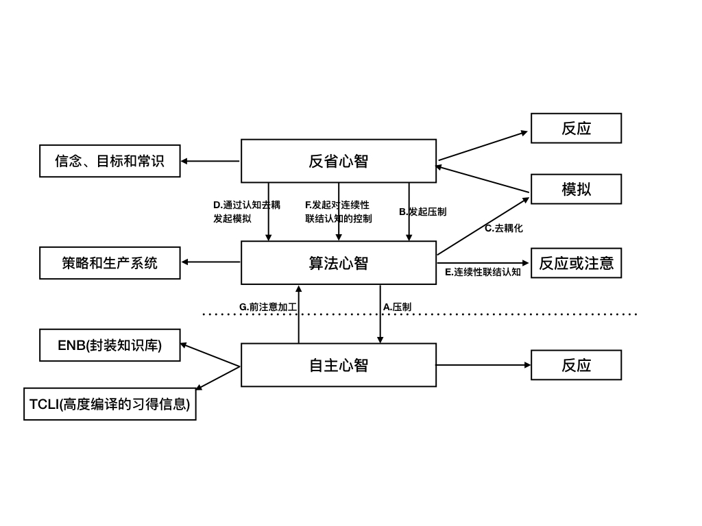

维基百科中这样定义理性：

> 理性（英语：Rationality）是指人类能够运用理智的能力。相对于感性的概念，它通常指人类在审慎思考后，以推理方式，推导出合理的结论。

理性常常和感性相对应，理性铁面无私，感性楚楚动人。理性人觉得感性人过于情绪化，无法沟通，感性人觉得理性人死板呆滞，只有逻辑不懂情趣。很多人认为理性是教科书上的逻辑推理，无趣无味，冲淡了人之为人的情感联结。但不能否认的是，人类工作生活是否如意很大程度上取决于有多理性。

那么，理性到底是什么？认知科学家如何看待理性？

## 工具性理性 & 认识性理性
认知科学家认为理性有两种类型：工具性理性和认识性理性。工具性理性是指个体基于已有的物质和精神条件，采取行动让自己得到想要的东西。也就是个体目标实现最优化。认识性理性是指个体的信念和认知是否符合真实世界。两种理性息息相关，认识性理性告诉我们什么是真实的，工具性理性告诉我们应该如何行动。一个理性的人，应该同时具备工具性理性和认识性理性，了解真实世界的样子，并知道如何最优化实现目标。

如此看来，理性并不等同于逻辑推理，而感性也并非和理性相冲突。感性即可以促进也可以损害工具性理性，认知科学中「情感」更强调情感适应和调节能力。当一个丧失情感只有理性的人思考如何达到目标时，可能有千千万万条思路，而情感阻止这种爆炸选择的情况发生。逻辑和情感都是理性思维的工具。

那么人类是否是理性动物呢？

一种主张的对面往往站着与之对立的另一种主张，双方剑拔弩张，互不相让。关于理性，就有这样两种主张。一边是社会改良主义，他们认为人类的推理能力并不理想，但可以通过教育和练习变得更加理性。社会改良主义表面上看起来相当积极，但背后隐藏着对人类智力的广泛侮辱，体现出反精英主义倾向。另外一边是过分乐观派，来自进化心理学家、适应主义建模者以及生态理论学家，他们认为人们已经具有完美理性，世间一切安排都是合理美好的。过分乐观派将已经发现的启发式偏见案例重新解读为更加理性的行为。

两种主张孰是孰非？社会改良主义有时会错失人类认知中存在的一些真正优势，而过分乐观派经常忽视通过努力可以改正的认知错误。是否存在一种能够融合两种观点的方式？

## 双重加工理论
基思·斯坦诺维奇和理查德·韦斯特提出了双重加工理论，大脑同时具有类型一与类型二两种加工过程。

* 类型一又被称为自动化加工，因为它执行很迅速；遇到刺激时会强制执行；不需要增加认知负荷；不依赖高阶控制系统的输入；多种类型一加工任务可同时进行，也可以与类型二平行工作，互不干扰。类型一加工是人类信息加工的默认方式，在完成很多重要工作时发挥效用，比如面部识别、本体感受、消解语言奇异、深度知觉等。
* 类型二与类型一相反，加工速度相对较慢，认知负荷高，在同一时间只能处理一个或几个任务，是序列加工。通常类型二的加工基于语言和规则，又被称为控制加工。当我们「有意识的解决问题」就是使用类型二加工。

类型一加工速度快但粗糙，在解决重大问题时，往往需要类型二加工进行压制，类型二加工需要具备能够中断类型一加工并且抑制其反应倾向的能力。此外，抑制仅是第一步，还需要更优化的替代反应，这来自于类型二的假设性推理和认知模拟。

假设性推理和认知模拟要求我们分清真实世界和假想的情景，发展心理学家艾伦·莱斯利把真实世界的表征称为「初级表征」，把复制和模拟的世界称为「次级表征」，区分这两者需要的是「去耦操作」。去耦需要消耗大量计算资源。当我们苦思冥想时，往往会闭上眼睛或盯着一个地方一动不动，这种行为是在阻止初级表征发生改变，干扰正在模拟的次级表征。

个体的类型一加工并没有太多差异，常见的智力测验更加偏向类型二的评估，也就是认知去耦。

## 三重加工心智模型

双重加工理论无法体现个体差异，也不能解释为什么很多智商高的人生活一团糟。斯坦诺维奇又提出了三重加工心智模型，将类型二分成反省心智和算法心智。个体流体智力的差异体现在算法心智层面，而思维倾向的差异体现在反省心智。

「反省心智关注系统目标、与目标相关的信念以及基于当前系统目标和信念的最优化行动。」只有在反省心智分析层面，理性才会参与其中，理性要求个体有正确的信念，并且基于信念采取合理行动以达成目标，比如目标管理、认识价值观、自我管理认识论等。

### 知识结构 

三重加工模型的每一层心智在执行操作时都必须以获取知识为前提：

* 反省心智从常识、个体观念、信念和目标结构中获取信息。—— 晶体智力／知识智力
* 算法心智可获取认知操作的微策略以及产生行为和想法的系统规则。—— 流体智力／加工过程智力
* 自主心智获取由进化过程编译的封闭知识库的信息，以及由学习和练习而进入自主心智的信息。

### 三重心智工作过程

* 压制功能：算法心智使类型一加工过程断线，从而达到压制目的。
	* 箭头B，反省心智发起压制操作，评估指标是个体的思维倾向，比如反省和认知需求；
	* 箭头A，算法心智对自主心智实施压制，评估指标是测量流体智力；
* 去耦化操作：压制之后进行假设性推理和认知模拟。
	* 箭头D，反省心智下达启动模拟命令，与理性思维倾向有关；
	* 箭头C，算法心智执行去耦化操作，与流体智力有关；
* 连续性联结认知：从给定的焦点规则出发，沿着规则为真的思路展开联结思维。如果个体仅仅基于某个焦点模型展开推理，而没有考虑到其他情境建模方式，就会产生「带有焦点偏差的连续性联结认知」。
	* 箭头F，反省心智发起对连续性联结认知的中断，改变下一步指导思维的连续性联结序列。中断后，可能启动模拟（箭头C），也可能开启新的连续性联结链（箭头E）
	* 箭头G，算法心智常常通过前注意加工收到来自自主心智计算后的信息输入。

通俗来讲，三重心智有三大功能：压制想法、推理和模拟、打破思维局限。在压制阶段，由反省心智发起，算法心智再对自主心智实施压制；推理和模拟时，反省心智发起模拟命令，算法心智通过分离真实和想象的世界对可能的方案在心中进行推理和预演；然而人们启动类型二思考时，默认会启动「连续性联结认知」，也就是基于自己现有的认知和想法进行推理和模拟，从而产生认知偏差，这时，需要反省心智发起中断，中断后，可能会重新模拟情境，也可能需要注意到新想法和线索。

从三重心智工作过程中我们可以看出，理性需要的心理特征：

1. 算法心智的认知能力，能够维持压制和模拟活动；
2. 反省心智能够发起对自主心智产生的劣质反应的压制，并且能够产生优化反应的模拟仿真；
3. 模拟活动中，可以获取理性反应计算所需要的心智程序。

## 理性障碍
现实生活中，不理智的例子比比皆是，智商高的人也会做很多愚蠢的事情。斯坦诺维奇提出「理性障碍」，试图引起人们对理性缺失的关注。他认为，人类不理性的主要原因有两个。第一，信息处理过程受到认知吝啬鬼的影响；第二，在进行理性思维和行为时，心智程序存在问题。

**认知吝啬鬼**：生物在进化过程中不断增加基因的繁殖适应性，而非人类理性。进化目的是最大化繁殖而不是快乐与幸福。所以，认知吝啬鬼成为了人们进行信息加工时的默认选项。

**心智程序问题**：「心智程序」的概念由哈佛大学认知科学家大卫·帕金斯（David Perkins）提出，指个体可以从记忆中提取出的规则、知识、程序和策略，以辅助决策判断和问题解决过程。心智程序存在两大问题，第一类称为「心智程序缺陷」，由于未掌握概率思维、逻辑、科学推理等理性工具而导致的不理性。第二类称为「污化的心智程序」，心智程序本身是有害的、无用的，不能帮助个体实现目标或是建立正确信念，甚至阻碍目标实现。

万幸，理性是可以习得的。

## 认知吝啬鬼
人类是认知吝啬鬼，默认依赖启发式加工，也就是类型一加工。启发式加工帮人类在严酷的自然环境中存活下来，然而在现代社会，越来愈多的人利用认知吝啬鬼的特点来设计陷阱，使个人失去自主性。启发式加工在98%的情况下是较优策略，用较低的能耗得到满意的结果，但剩下的2%往往是决定人生幸福与否的关键事件。

认知吝啬鬼有一个特点是「我方立场信息加工」，大脑以自己的立场找到世界的模式，解释一切现象，甚至试图找到随机事件的规律。我方信息加工阻止人们客观评价证据，也阻碍人们产生可观证据，常常发生过度自信的情况。举例来说，当人们使用邮件进行沟通时，往往会从自己的立场出发，认为文字已经表达了自己想要说的，然而脱离了语调、表情和重音，邮件中的文字有极大可能被误解。再举一个例子，产品经理在设计产品时，往往从自己的角度出发，给产品加上很多自以为是的功能，结果反而损害了用户体验。

认知吝啬鬼还有一个缺陷，即使启动了反省心智和算法心智，深思熟虑后人们还是不由自主向认知吝啬鬼投降。典型例子就是即刻满足和延迟满足的冲突，人们的行为常常违背自己的长期目标，这种现象可以用「双曲线贴现曲线」来解释，这是决定预期收益打折速度的函数，这个函数表现人们会高估眼前的奖励，而忽视长远目标，还会让人们的偏好随着时间变化而变化。之前做的计划会在实施中被推翻，而随着时间推移，又回后悔当初的决定。是吃下面前这块甜点从明天开始减肥，还是拒绝这块甜点去健身房以便获得好身材？一旦选择了面前的甜点，就会发现日复一日，离目标渐行渐远。为了增强长期目标的战胜的概率，可以使用言语放大妥协后的损失，比如「如果我现在吃了这块甜点，那么未来我可能每天都会吃，这样绝对威胁到我的好身材。」将现在的行为与未来的目标绑定在一起，也许可以使自我获得强大的动机性力量，和当前的诱惑进行抗衡。

想要避免认知吝啬鬼对理性的影响，首先就要意识到生活中大部分时间大脑正在使用自动化加工，在关键决策的时候，有意识避免无脑加工，尝试**完全析取推理**（充分考虑所有可能的选项），这才是提升认知的开始。

另外，改善决策环境，利用默认框架等手段，也能够帮助认知吝啬鬼作出更有利于自身的选择。比如增强自制力有两种方法，第一种是改变人，增强内在的自我控制力或是提升动机；第二种就是主动减少需要自制力的需求，常见策略是事前承诺，比如自动加入储蓄计划、提前打包多余饭菜。改变人比较困难，而改变环境相对容易一些。

## 心智程序缺陷
心智程序缺陷是指人们没有安装足够的心智程序，如忽略备择假设，不擅长寻求证伪焦点假设。缺陷有很多种类，斯坦诺维奇着重展示了科学性思维规则的缺失和概率思维规则的缺失。那么如何利用科学性思维和概率思维提升理性呢？

* **贝叶斯思维**
	* 焦点假设的后验概率 = 相似率 * 先验概率。P(H/D)/P(~H/D) = P(D/H)/P(D/~H) * P(H)/P(~H) 
	* 意识到P(D/~H)的重要性，也就是假设不成立的条件下出现这些证据的概率，通俗一点，就是反向思考。
	* 重视基础概率。避免被鲜活个案影响。
	* 信念应该根据出现的证据不断进行修正。
* **思考备择假设**。了解在自变量不变的情况下会发生什么，也就是使用对照组。
* **概率思维**：重视子集和全集之间的关系，不应根据相似性作为判断标准。—— 著名的琳达问题。避免条件概率倒置，B能推导出A，而A不一定能推导出B。
* 学会推导因果关系。比如使用**执行意图**，个体有意识说出某一行为序列的顺序：当X发生时，我就做Y。在语言固定情境属性的帮助下，可以在自主心智中建立起固定思维。
* 构建**心理目标**，设定一个具体的、有挑战性的目标，而不是鼓励性指令。

## 污化的心智程序

污化的心智程序是指被不利于个体理性生活的模因影响，比如相信笔迹学、占星术等。心智缺陷常会影响工具理性（实现目标），而污化的心智程序则会扰乱知识理性（世界的真实样子）。当然，也有很多可以通过学习掌握的策略避免心智程序被污化。

* **可证伪性**，人们天生思维倾向是寻找证实假设的证据，而非证伪的证据，尝试假设自己的想法是错误的，并为此寻找证据。
* **批判性思维技巧**，小心那些拒绝对自身进行评估的心智程序，多问一些问题。
* **模因语言学**，模因是文化传播的最小单位，避免安装那些对自身有害的模因。
* 人们都有「知识投影倾向」，用已有观念作为过滤器来处理新数据，使知识积累的速度更快。所以要让自己处于绝大多数信念都为真的知识领域，比如科学领域，就可以利用当前的知识结构帮助自己更快吸收新知识。

## 小结
智商能否通过后天努力获得改善尚有争议，但理性思维是可以习得的。斯坦诺维奇给出了很多提升理性思维的方法，上面仅仅是简单的归纳整理，需要不断实践练习才能内化。

小到改善生活，大到实现人生目标，你我都需要理性加持，共勉～

